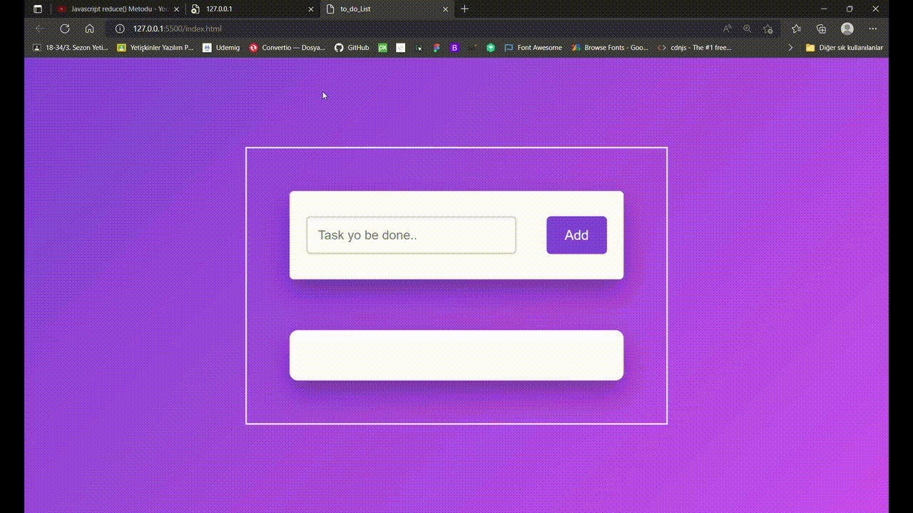

# to_do_List

<h1>What is it about?
<h6>A formation allowing to do an ordered list in a context desired by adding, deleting and marking as complated items.

<h3>How it's made?
<h6>That is a work which includes an intensive Javascript code serie. 
